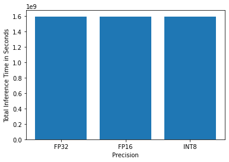
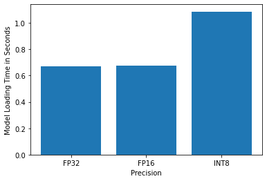
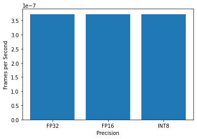

# Computer Pointer Controller

In this project, used a gaze detection model to control the mouse pointer of your computer. By using the [Gaze Estimation](https://docs.openvinotoolkit.org/latest/omz_models_intel_gaze_estimation_adas_0002_description_gaze_estimation_adas_0002.html) model to estimate the gaze of the user's eyes and change the mouse pointer position accordingly. This project will demonstrate the ability to run multiple models in the same machine and coordinate the flow of data between those models.


## How Project Works

By using the InferenceEngine API from Intel's OpenVino ToolKit to build the project. The gaze estimation model requires three inputs:
* The head pose
* The left eye image
* The right eye image.

To get these inputs, you will have to use three other OpenVino models:
* [Face Detection](https://docs.openvinotoolkit.org/latest/omz_models_intel_face_detection_adas_binary_0001_description_face_detection_adas_binary_0001.html)
* [Head Pose Estimation](https://docs.openvinotoolkit.org/latest/omz_models_intel_head_pose_estimation_adas_0001_description_head_pose_estimation_adas_0001.html)
* [Facial Landmarks Detection](https://docs.openvinotoolkit.org/latest/omz_models_intel_landmarks_regression_retail_0009_description_landmarks_regression_retail_0009.html)

## The Pipeline

You will have to coordinate the flow of data from the input, and then amongst the different models and finally to the mouse controller. The flow of data will look like this:


While building the flow, need to make sure that the input and output shapes of each model.


## Project Set Up and Installation

### Hardware Requirements for Installation (any one)
* 6th-10th Generation Intel® Core™ processors
* Intel® Xeon® v5 family
* Intel® Xeon® v6 family
* Intel® Movidius™ Neural Compute Stick
* Intel® Neural Compute Stick 2
* Intel® Vision Accelerator Design with Intel® Movidius™ VPUs


### Model Requirements
The model can be downloaded using the model downloader. The models you will need are:
* [Face Detection](https://docs.openvinotoolkit.org/latest/omz_models_intel_face_detection_adas_binary_0001_description_face_detection_adas_binary_0001.html)
* [Head Pose Estimation](https://docs.openvinotoolkit.org/latest/omz_models_intel_head_pose_estimation_adas_0001_description_head_pose_estimation_adas_0001.html)
* [Facial Landmarks Detection](https://docs.openvinotoolkit.org/latest/omz_models_intel_landmarks_regression_retail_0009_description_landmarks_regression_retail_0009.html)
* [Gaze Estimation Model](https://docs.openvinotoolkit.org/latest/omz_models_intel_gaze_estimation_adas_0002_description_gaze_estimation_adas_0002.html)

***Model Download Command***
```bash
cd /opt/intel/openvino/deploymentools/open_model_zoo/tools/downloader/
./downloader.py --name face-detection-adas-binary-0001 -o ~/models
./downloader.py --name head-pose-estimation-adas-0001 -o ~/models
./downloader.py --name landmarks-regression-retail-0009 -o ~/models
./downloader.py --name gaze-estimation-adas-0002 -o ~/models
```

### Project Set Up
1. Download and install the [OpenVINO Toolkit](https://docs.openvinotoolkit.org/latest/index.html)
2. Clone this git repository into your local machine.
3. Create a virtual nvironment for the project.
3. Install all the dependency packages for the project.
4. Run the `main.py` file.


## Demo Example

1. Clone this git repository into your local machine.
```bash
git clone https://github.com/MrinmoiHossain/Computer-Pointer-Controller.git
cd Computer-Pointer-Controller
```

2. Create a virtual nvironment for the project.
```bash
python3 -m venv venv
source venv/bin/activate
source /opt/intel/openvino/bin/setupvars.sh
```

3. Install all the dependency packages for the project.
```bash
pip install -r requirements.txt
```

4. Run the `main.py` file.
```bash
python3 src/main.py -mfd models/face-detection-adas-binary-0001/FP32-INT1/face-detection-adas-binary-0001.xml \
                    -mfl models/landmarks-regression-retail-0009/FP16-INT8/landmarks-regression-retail-0009.xml \
		            -mhp models/head-pose-estimation-adas-0001/FP16-INT8/head-pose-estimation-adas-0001.xml \
		            -mge models/gaze-estimation-adas-0002/FP16-INT8/gaze-estimation-adas-0002.xml \
                    -i bin/demo.mp4 -d "CPU" -sv "yes"
```

## Documentation

### Project File Structure
```
.
├── bin
│   └── demo.mp4
├── GazeApp.log
├── img
│   ├── FPS.png
│   ├── Model_Loading_Time.png
│   ├── output_video.gif
│   ├── Project_Pipeline.png
│   └── Total_Inference_Time.png
├── models
│   ├── face-detection-adas-binary-0001
│   │   └── FP32-INT1
│   │       ├── face-detection-adas-binary-0001.bin
│   │       └── face-detection-adas-binary-0001.xml
│   ├── gaze-estimation-adas-0002
│   │   ├── FP16
│   │   │   ├── gaze-estimation-adas-0002.bin
│   │   │   └── gaze-estimation-adas-0002.xml
│   │   ├── FP16-INT8
│   │   │   ├── gaze-estimation-adas-0002.bin
│   │   │   └── gaze-estimation-adas-0002.xml
│   │   └── FP32
│   │       ├── gaze-estimation-adas-0002.bin
│   │       └── gaze-estimation-adas-0002.xml
│   ├── head-pose-estimation-adas-0001
│   │   ├── FP16
│   │   │   ├── head-pose-estimation-adas-0001.bin
│   │   │   └── head-pose-estimation-adas-0001.xml
│   │   ├── FP16-INT8
│   │   │   ├── head-pose-estimation-adas-0001.bin
│   │   │   └── head-pose-estimation-adas-0001.xml
│   │   └── FP32
│   │       ├── head-pose-estimation-adas-0001.bin
│   │       └── head-pose-estimation-adas-0001.xml
│   └── landmarks-regression-retail-0009
│       ├── FP16
│       │   ├── landmarks-regression-retail-0009.bin
│       │   └── landmarks-regression-retail-0009.xml
│       ├── FP16-INT8
│       │   ├── landmarks-regression-retail-0009.bin
│       │   └── landmarks-regression-retail-0009.xml
│       └── FP32
│           ├── landmarks-regression-retail-0009.bin
│           └── landmarks-regression-retail-0009.xml
├── README.md
├── requirements.txt
├── result
│   ├── FP16
│   │   └── stats.txt
│   ├── FP32
│   │   └── stats.txt
│   ├── INT8
│   │   └── stats.txt
│   ├── output_video.mp4
│   └── stats.txt
└── src
    ├── face_detection.py
    ├── facial_landmarks_detection.py
    ├── gaze_estimation.py
    ├── head_pose_estimation.py
    ├── input_feeder.py
    ├── main.py
    ├── model.py
    ├── mouse_controller.py
    ├── Project_Benchmarks.ipynb
    └── queue_job.sh

```

### Project Command Line Arguments
```
Usage: main.py  [-h] -mfd FACEDETECTIONMODEL -mfl FACIALLANDMARKSMODEL 
                -mhp HEADPOSEMODEL -mge GAZEESTIMATIONMODEL -i INPUT 
                [-l CPU_EXTENSION] [-d DEVICE] [-pt PROB_THRESHOLD]
                [-o OUTPUT] [-sv SHOW_VIDEO]

Arguments:
    -h, --help                      Show help message.
    -mfd, --faceDetectionModel      Path of xml file of face detection model.
    -mfl, --facialLandmarksModel    Path of xml file of facial landmarks detection model.
    -mhp, --headPoseModel           Path of xml file of head pose estimation model.
    -mge, --gazeModel               Path of xml file of gaze estimation model.
    -i, --input                     Path to image or video file.
    -l, --cpu_extension             MKLDNN (CPU)-targeted custom layers. Absolute path to a shared library with the kernels impl.
    -d, --device                    Specify the target device to infer on: "CPU, GPU, FPGA or MYRIAD is acceptable".
    -pt, --prob_threshold           Probability threshold for detections filtering (0.6 by default).
    -o, --output_path               Output video path.
    -sv, --show_video               Output video show mode.
```

## Benchmarks
In this project, Inference Time, FPS and Model Loading Time is checked for INT8, FP16, FP32 (except - Face Detection Model). The output graphs of the test are given below - 

* [Benchmarks Test](https://github.com/MrinmoiHossain/Computer-Pointer-Controller/blob/master/src/Project_Benchmarks.ipynb)
### Inference Time

### Model Loading Time

### FPS


## Results
| Precision | Inference Time | Model Loading Time  |          FPS           |
|:----------|:--------------:|:-------------------:|-----------------------:|
|   INT8    |  1595880096.3  |  1.086348295211792  | 3.728350277564647e-07  |
|   FP16    |  1595880258.7  |  0.6771125793457031 | 3.728349898160188e-07  |
|   FP32    |  1595880351.3  |  0.6721317768096924 | 3.7283496818249225e-07 |

* For, Inference time data see that there is not much difference for this three different precision models. Among this three precision, FP32 is higher because of higher precision value.
* And, for FPS, it is also similar to the inference time. That's mean smaller difference for this three different precision models.
* In, Model Loading time, INT8 precision model's time is much higher than any others because combination of precisions lead to higher weight of the model.

## Stand Out Suggestions

### Async Inference
By using async inference will use the all cores of CPU improve performance with threading the ability to perform multiple inference at the same time. On the other side, at synchrounous inference, the inference request need to be waiting until the other inference request executed.

### Edge Cases
* Multiple People: If there found more than one person in the image, the detection and pointer control would only detect first person that the models detect first.

## Resourses
* [Inference Engine API Docs](https://docs.openvinotoolkit.org/latest/openvino_inference_engine_ie_bridges_python_docs_api_overview.html)
* [Model Documentation](https://docs.openvinotoolkit.org/latest/omz_models_intel_index.html)